# webOS Dev Mode Manager

> Unaffiliated with LG Electronics Inc. or the webOS Open Source Edition
> project.

A mobile-first Android app for LG webOS TVs in Developer Mode. Pair a TV
from a phone, install homebrew apps on it, and keep track of how long the
Developer Mode session has left.

- **Website**: [aphanes-app.vercel.app](https://aphanes-app.vercel.app)
- **Download**: [the latest APK](https://github.com/symonxdd/aphanes/releases/latest)
- **Technical documentation**: [symonxdd.github.io/aphanes](https://symonxdd.github.io/aphanes/)

## Screenshots

| Devices | Devices, OLED | Device detail | Apps | Catalog |
|:--:|:--:|:--:|:--:|:--:|
| 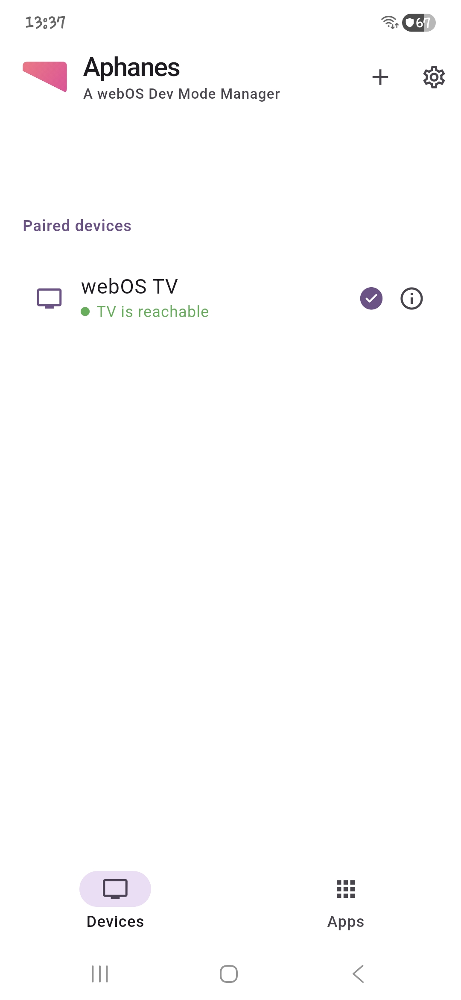 | 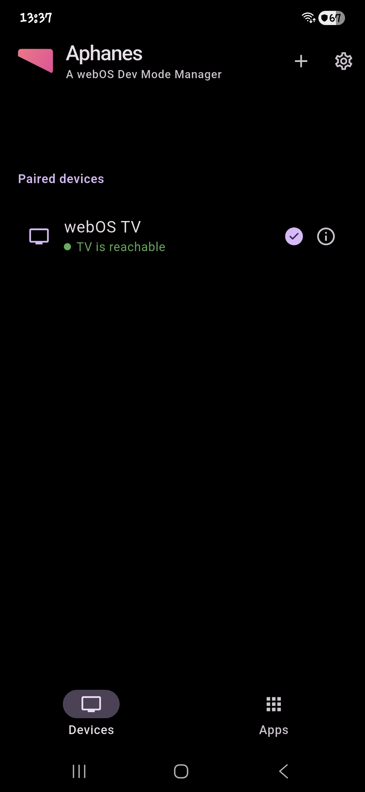 | 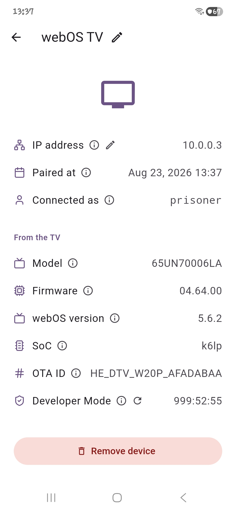 | 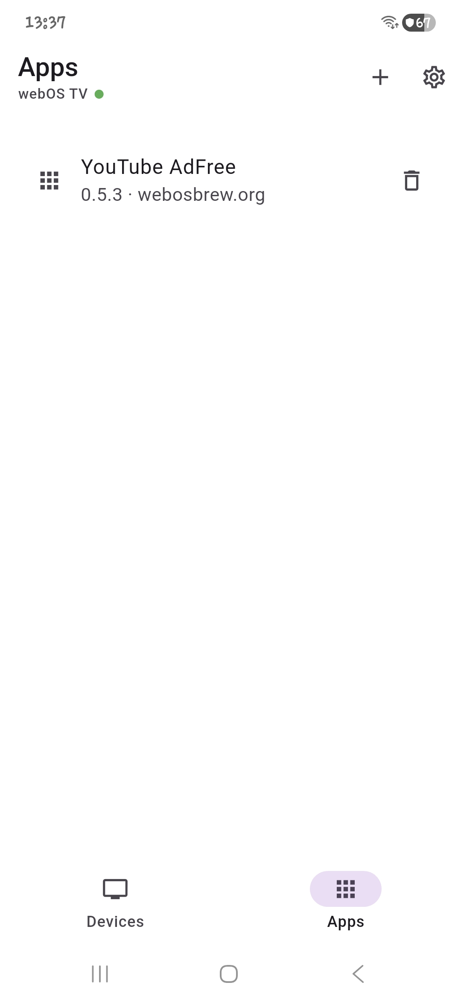 | 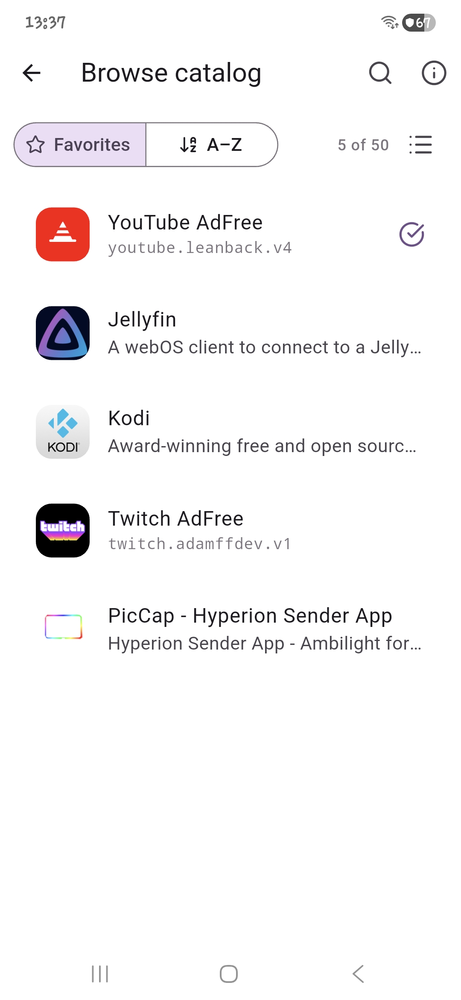 |

| Install an app | Pair a device | Field explainer | Title card |
|:--:|:--:|:--:|:--:|
| 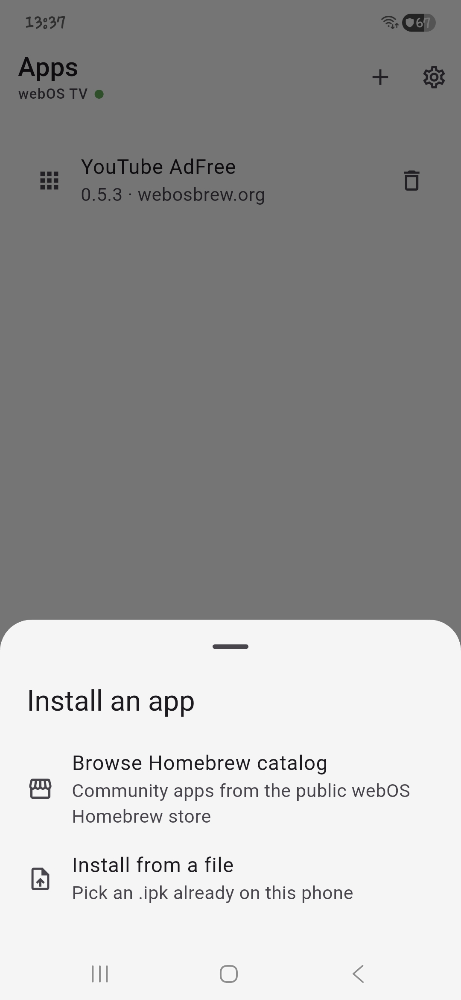 | 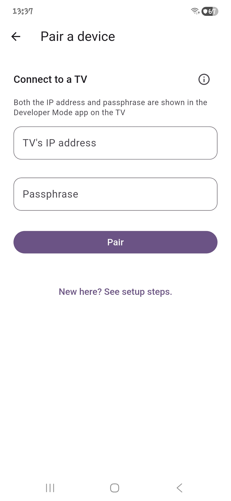 | 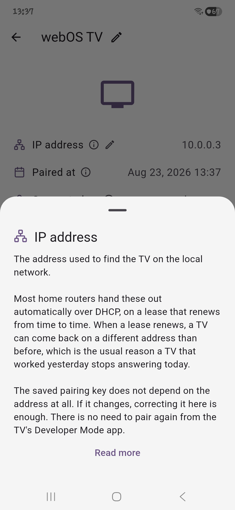 | 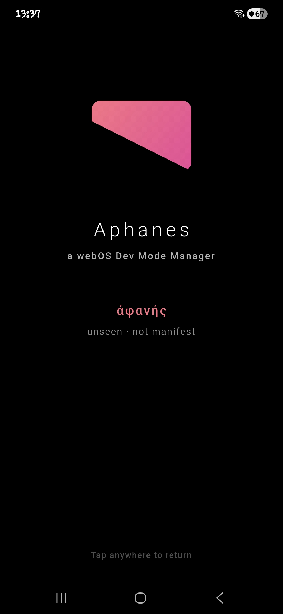 |

| First run | First run, OLED | Settings | About |
|:--:|:--:|:--:|:--:|
| 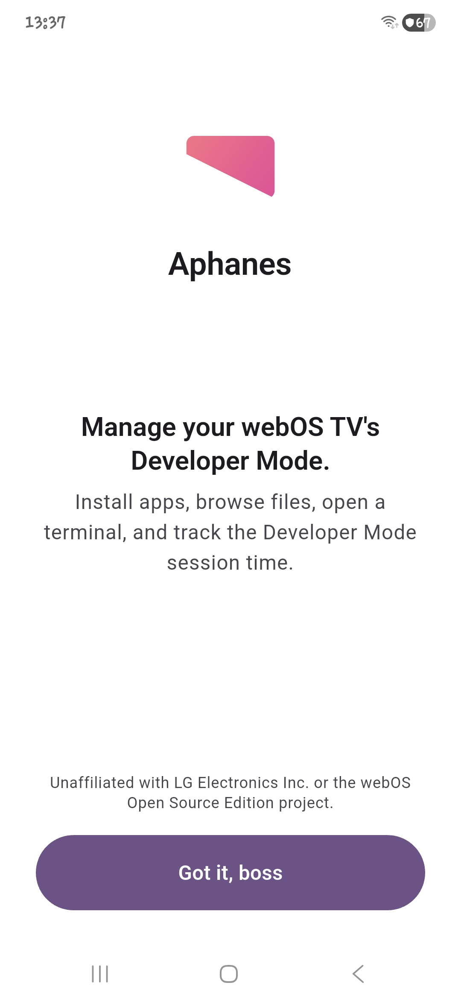 | 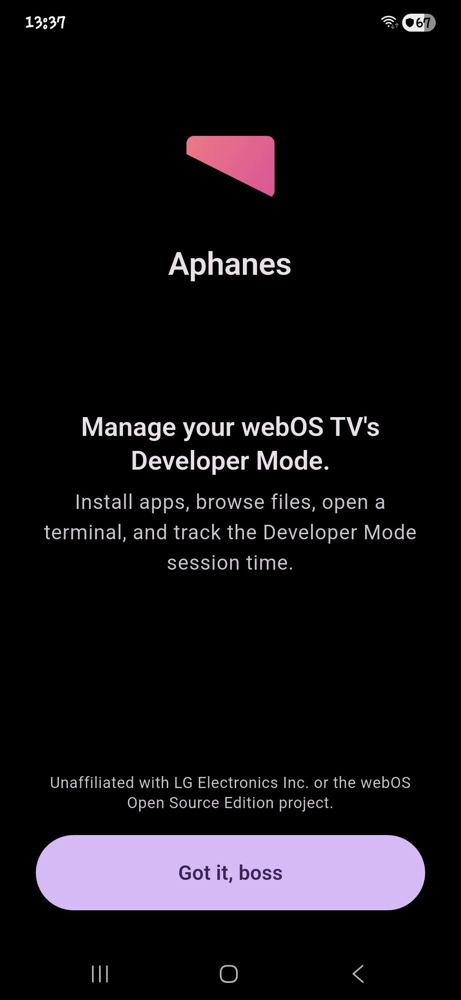 | 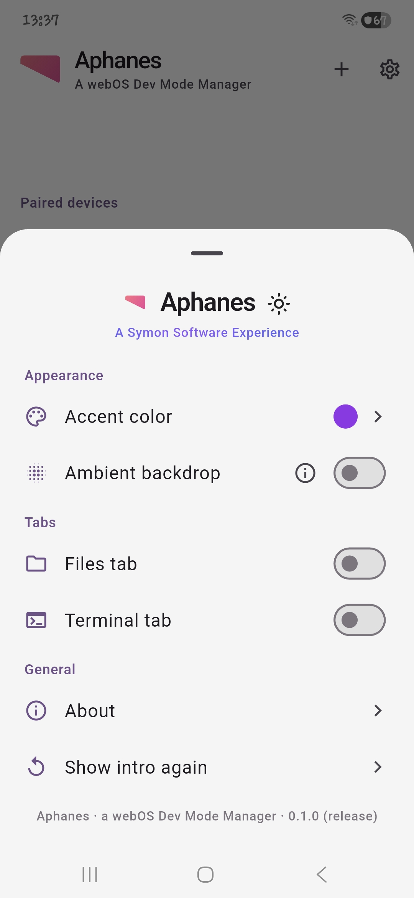 | 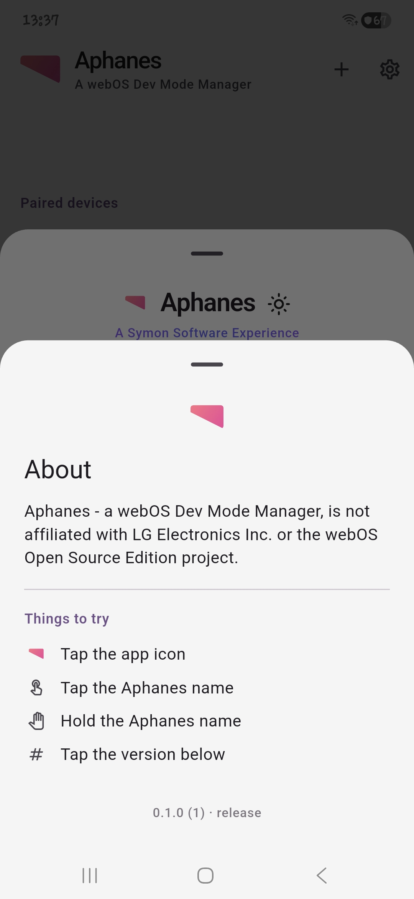 |

## Why it exists

This exists to fix the mobile experience of the community's
[dev-manager-desktop](https://github.com/webosbrew/dev-manager-desktop),
which is desktop-first: content draws under the system status and
navigation bars on a phone, the bottom navigation is icon-only with no
labels, and deleting a paired device is hard to find.

## Status

The Android app is feature complete for what it set out to do. Working
today:

- Pair a TV, keep several, and switch between them
- Install apps from the Homebrew catalog or from a local .ipk
- See a TV's hardware and firmware, and how long its Developer Mode
  session has left
- Renew that session without leaving the couch

Not built: an SFTP file browser and an SSH terminal. Both have a tab
reserved, hidden by default, and neither is ruled out.

A desktop counterpart is planned and lives as an empty placeholder in
[/desktop](desktop).

## Technical documentation

How the app is built and how the webOS side of it works.

The full site is at **[symonxdd.github.io/aphanes](https://symonxdd.github.io/aphanes/)**, or browse the same content directly in [docs/](docs/):

- [docs/README.md](docs/README.md): project overview and current status
- [docs/concepts.md](docs/concepts.md): plain-language explanations of every technology involved (Developer Mode, SSH, the luna bus, IPK packages, OTA IDs), plus a glossary
- [docs/architecture.md](docs/architecture.md): tech stack, folder structure, and the reasoning behind each decision
- [docs/pairing.md](docs/pairing.md): how the Developer Mode key exchange actually works, and the security choices behind it

## Getting started

This is a standard Flutter project.

```
flutter pub get
flutter run
```

## Releasing

Making a release is one command:

```
dart run tool/release.dart
```

It refuses to run on a dirty working tree, then:

1. Asks whether this is a patch, minor or major release, and shows the
   exact version it would move to
2. Bumps `version:` in [pubspec.yaml](pubspec.yaml), including the build
   number after the `+`, which Android requires to increase every time
3. Commits that one line as `chore(release): bump version to x.y.z`
4. Tags it `vx.y.z` and pushes the commit and the tag

Pushing the tag is what starts
[release.yml](.github/workflows/release.yml), which:

- Runs `flutter analyze` and `flutter test`, and stops if either fails
- Builds an arm64 release APK, signed with the release keystore held in
  repository secrets
- Publishes a GitHub release with `aphanes-vx.y.z.apk` attached and
  notes generated from the commits since the last tag

Progress shows under the repository's Actions tab. Nothing is built
locally.

### Signing

Release builds are signed from `android/key.properties` locally, or from
`ANDROID_KEYSTORE_*` repository secrets in CI. Neither is in the
repository. Without either, a release build falls back to the debug key
so it still compiles for anyone without the keystore; the workflow
checks the keystore arrived before it builds, so a release can never be
published that way.

## Privacy and safety

- Managing a TV happens directly between this app and the TV on the
  local network. No third-party server sits in that path, and device
  lists, files, and credentials never leave the phone. None of it is
  synced to a cloud anywhere.
- Device credentials are stored via secure platform storage, never in
  plaintext, never logged.
- No telemetry, analytics, or crash reporting without an explicit,
  separate opt-in. Nothing about how the app is used is reported
  anywhere.
- Every TV-modifying action (install, uninstall, file write/delete,
  terminal command) happens only when directly triggered.

Three things reach the internet, each only when opened or used:

- **Browsing the Homebrew app catalog** reads the public listing at
  repo.webosbrew.org, and loads package icons from there. Nothing about
  the phone or its paired TVs is sent.
- **Installing an app from that catalog** downloads it from wherever
  the catalog points, which today is GitHub for nearly every entry. Each
  download is verified against the catalog's published SHA-256 and
  refused on a mismatch.
- **The Developer Mode remaining-time check**, on a device's detail page,
  asks developer.lge.com, sending the session token read from the TV.
  This is the only one of the three that sends any data, and it is here
  because nothing local can answer the question. Renewing does not use
  it: that only tells the TV to open its own Developer Mode app.

## Credits

The webOS devmode pairing protocol (the TV's key server and its key
exchange) is implemented here, informed by reading the
community's [dev-manager-desktop](https://github.com/webosbrew/dev-manager-desktop)
and [ares-cli-rs](https://github.com/webosbrew/ares-cli-rs) projects
(both Apache-2.0).
